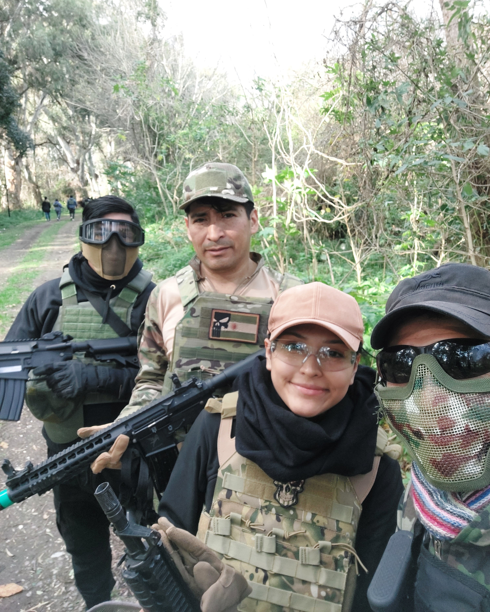
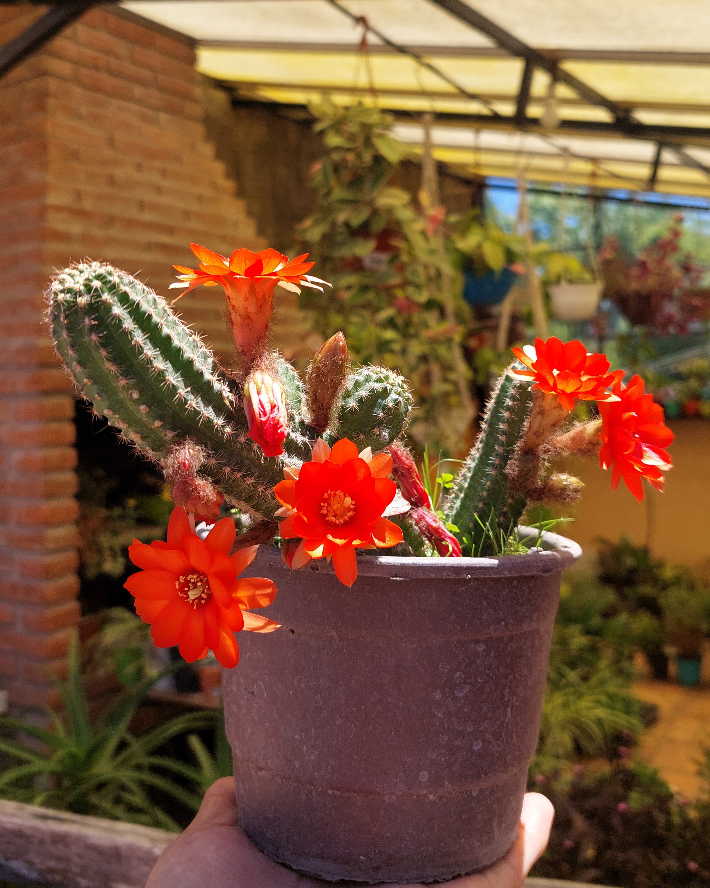

# Presentación

- Legajo: 214.234-0

Hola mi nombre es Malena Soledad Vincenti Anave entré a la facultad en 2023 y considero que voy a un ritmo más tranquilo que otros.

Siempre he sido una persona algo dispersa lo que me llevo ha probar diversas actividades y mantenerme activa.
Hice natación por mucho tiempo y tuve la oportunidad de tocar el violín en una orquesta juvenil durante unos 4 años hasta que inició la pandemia.

Desde mediados de 2023 empecé a jugar airsoft, nos reunimos una vez al mes en partidas publicas o privadas entre familia y amigos, aunque es más lindo ir en climas frescos como otoño e invierno principalmente ya que correr toda tapada con calor y una réplica pesada de poco más de 2 kilos si que es algo dificil.

El año pasado redescubrí el vóley, ya que había aprendido lo básico de niña en un verano con mis abuelos, ahora este año juego en recreativos mixtos todas las semanas. También tengo actividades que me relajan me gusta hacer pequeños proyectos a crochet y cuidar mis plantas, que por cierto tengo muchas más que nada plantas de interior y suculentas.

Me enorgullece ver a mis cactus florecer, es triste que en algunas especies su flor solo dura un día o unas pocas horas.

Con tantas cosas que me gusta hacer uno termina aprendiendo a organizarce para hacerlas todas. Y ahora que escribo esto me doy cuenta de que quizá tengo demasiados hobbies pero creo que es importante tener algo que te mueva, cualquier actividad que te ayude a desconectar y recargar energías.